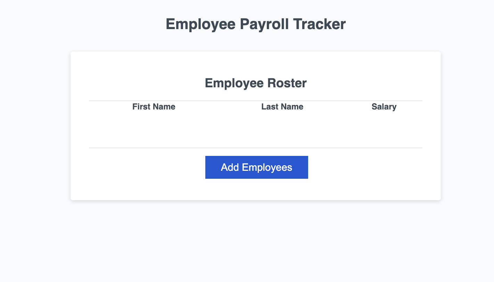
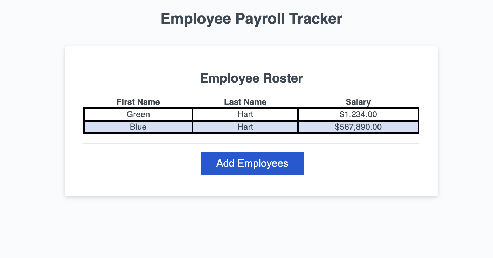

# Employee Payroll
## Author: Sylvester Assiamah - Module 3 

## Description

This webpage presents an optimized and streamlined version of an Employee Payroll Tracker. The code has been meticulously cleaned up and tailored to meet the user's specifications, ensuring efficient management of employee data. Minor adjustments have been made to elements and tags for improved clarity and consistency. Comments have been strategically added to elucidate key sections of the code, enhancing understanding and maintainability. The overall functionality and appearance of the webpage have been thoughtfully preserved, facilitating seamless tracking of employee information.

## Visuals

## Deployment

Access the deployed webpage via this link: [Module 03](https://assiamahs.github.io/employee_payroll/)

## Usage

To navigate the webpage, click on the header links at the top of the page to review each section. To inspect individual elements, open Chrome DevTools by pressing Command+Option+I (macOS) or Control+Shift+I (Windows). A console panel will open either below or beside the webpage in your browser. From there, navigate to the Accessibility tab to highlight each picture element.

## Credits

- ASKBCS - Assisted in linking images correctly in the readme file.

## License

Please refer to the LICENSE file in the repository.
